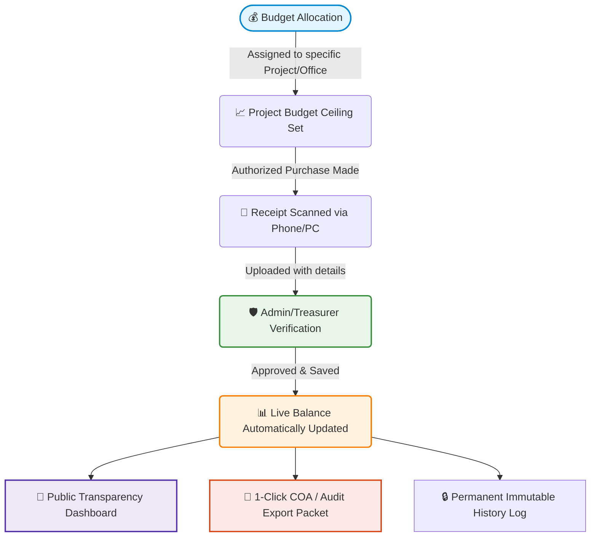

# 🏛️ Local Government Unit (LGU) Financial Transparency & Governance System
## Executive Proposal & Non-Technical Case Study Guide

> **Document Type:** Executive Briefing & Decision-Maker Presentation  
> **Target Audience:** Local Chief Executives (Mayors/Governors/Deans), Sanggunian Members, Barangay Captains, Treasurers, Budget Officers, Planning Coordinators, and Department Heads.  
> **Core Objective:** Plain-language demonstration of how modernizing our financial management builds constituent trust, ensures 100% audit readiness, and saves hundreds of staff hours.


## 📑 Table of Contents
1. [Executive Summary](#1-executive-summary)
2. [The Reality Today: The Cost of Traditional Manual Systems](#2-the-reality-today-the-cost-of-traditional-manual-systems)
3. [The Solution: LGU Financial Transparency & Monitoring System](#3-the-solution-lgu-financial-transparency--monitoring-system)
4. [System Tour in Plain English (Zero Tech Jargon)](#4-system-tour-in-plain-english-zero-tech-jargon)
5. [Real-World Case Studies & Scenarios](#5-real-world-case-studies--scenarios)
6. [Department-by-Department Benefits Matrix](#6-department-by-department-benefits-matrix)
7. [The Journey of One Peso: Visual Workflow](#7-the-journey-of-one-peso-visual-workflow)
8. [Security, Accountability & Legal Compliance](#8-security-accountability--legal-compliance)
9. [Smart AI Assistant: Your 24/7 Office Companion](#9-smart-ai-assistant-your-247-office-companion)
10. [Implementation Plan & 4-Week Rollout Roadmap](#10-implementation-plan--4-week-rollout-roadmap)
11. [Frequently Asked Questions (FAQ) for Officers](#11-frequently-asked-questions-faq-for-officers)
12. [Next Steps & Recommendation for Official Adoption](#12-next-steps--recommendation-for-official-adoption)

---

## 1. Executive Summary

Every Local Government Unit runs on the public trust. Whether managing municipal funds, barangay budgets, student council resources, or departmental allocations, every single peso entrusted to public servants must be accounted for accurately, promptly, and transparently.

### The Big Picture
Our **LGU Financial Transparency and Monitoring System** is an all-in-one, user-friendly digital platform that replaces cluttered spreadsheets, missing paper receipts, and delayed liquidations with **instant, real-time financial tracking**.

```
┌─────────────────────────┐     ┌─────────────────────────┐     ┌─────────────────────────┐
│   1. Real-Time Clarity  │     │   2. Bulletproof Audit  │     │   3. Constituent Trust  │
│ Know exact fund balance │ ──> │ Every receipt scanned,  │ ──> │ Public transparency     │
│ across all departments  │     │ logged & tamper-evident │     │ dashboard for citizens  │
│ in 1 single second.     │     │ ready for COA review.   │     │ & stakeholders.         │
└─────────────────────────┘     └─────────────────────────┘     └─────────────────────────┘
```

### Why Decision-Makers Approve This:
- **No special IT skills required:** As easy to use as social media or digital banking apps.
- **Works on any device:** Runs on desktop computers in the office, tablets during field visits, and smartphones for on-the-go checks.
- **Drastically cuts liquidation time:** From 2–3 weeks of paper gathering to a single click.
- **Compliant with Good Governance Standards:** Supports the Department of the Interior and Local Government (DILG) Full Disclosure Policy and Commission on Audit (COA) requirements.


## 2. The Reality Today: The Cost of Traditional Manual Systems

### The 4 Major Bottlenecks Faced by Government Offices

| Problem Area | What Happens Today (Manual / Spreadsheets) | The Consequence |
| :--- | :--- | :--- |
| 🗄️ **Receipt Storage** | Paper receipts placed in shoe boxes, folders, or plastic envelopes; ink fades over 3–6 months. | Disallowed expenses during audit inspections; lost proof of purchases. |
| 📊 **Fund Monitoring** | Excel sheets updated by separate officers; multiple conflicting versions exist on different USB drives. | Accidental overspending; officers don't know real-time remaining balances. |
| ⏳ **Liquidation Bottlenecks** | Gathering receipts, balancing totals, and drafting reports takes weeks of overtime before deadlines. | Delayed releases for future project funding; unliquidated cash advances. |
| 🗣️ **Public Skepticism** | Citizens and members ask *"Saan napunta ang pondo?"* (Where did the money go?) but reports are published late or on printed paper boards. | Misinformation, public distrust, and lack of engagement from constituents. |


## 3. The Solution: LGU Financial Transparency & Monitoring System

The system acts as a **Single Source of Truth** for the entire organization. It connects leadership, financial officers, project leads, and citizens into one synchronized, transparent ecosystem.

```
                     ┌─────────────────────────────────────────┐
                     │    EXECUTIVE LEADERSHIP & TREASURY      │
                     │ (Full Oversight, Approvals & Reporting) │
                     └────────────────────┬────────────────────┘
                                          │
                     ┌────────────────────┴────────────────────┐
                     │     CENTRAL SECURE FINANCIAL VAULT      │
                     │  - Real-Time Budget Allocations         │
                     │  - Digital Receipts & Proof Storage     │
                     │  - Automatic Income & Collection Sync   │
                     │  - Permanent Activity Audit Log         │
                     └────────────────────┬────────────────────┘
                                          │
                     ┌────────────────────┴────────────────────┐
                     │      PUBLIC TRANSPARENCY PORTAL         │
                     │  Constituents & Stakeholders can view   │
                     │   project expenses, fund balances, and  │
                     │    verified official liquidation data   │
                     └─────────────────────────────────────────┘
```


## 4. System Tour in Plain English (Zero Tech Jargon)

Here is what each module does in simple government operational terms:

### 1. Executive Dashboard (The "Control Tower")
* **What it looks like:** A clean screen with 4 colored cards showing:
  - **Total Income Received** (All collections, budget releases, and grants)
  - **Total Expenses Incurred** (All approved expenditures)
  - **Remaining Usable Balance** (Exact funds available *right now*)
  - **Donations & Special Funds** (Restricted or earmarked contributions)
* **Value:** The Mayor, Captain, or Head Officer can open their screen at 8:00 AM and instantly know the exact financial standing of every project without waiting for weekly summary memos.

### 2. Events & Projects Tracker (The "Project Ledger")
* **What it does:** Breaks down the budget by specific projects (e.g., *Community Outreach, Health Caravan, Inter-Barangay Sports Fest, Infrastructure Maintenance*).
* **Key Feature:** Each project has its own allocated budget ceiling, real-time spending progress bar, and list of purchases.
* **Value:** Prevents project coordinators from exceeding their allocated budget.

### 3. Digital Transactions & Receipt Vault (The "Shoebox Killer")
* **What it does:** Whenever an expense is made, staff take a photo or scan of the official receipt (OR), sales invoice, or acknowledgment receipt, and upload it with date, vendor, and amount.
* **Key Feature:** High-resolution digital copy is permanently attached to the transaction. 
* **Value:** No more faded thermal receipts! An auditor can click any transaction and immediately inspect the clear digital receipt.

### 4. Income & Collections Management (The "Cash Register")
* **What it does:** Records all incoming collections, dues, registrations, or sponsor donations with automatic receipt references.
* **Value:** Eliminates missing collection envelopes and simplifies cash reconciliation for the Treasurer.

### 5. Instant Reports & COA-Ready Exports (The "One-Click Report")
* **What it does:** Generates clean, ready-to-print financial statements, balance sheets, and itemized expenditure reports with standard official headers and signatory fields.
* **Value:** Saves 80% of report preparation time before council sessions and audit meetings.

### 6. AI Interactive Assistant ("Grizz / Ursa")
* **What it does:** A friendly digital guide that staff and constituents can click on to ask questions like:
  - *"How much budget is left for Project X?"*
  - *"Show me the top 3 biggest expenses this month."*
  - *"Where can I download the latest financial statement?"*
* **Value:** Answers routine inquiries 24/7 without burdening office staff.


## 5. Real-World Case Studies & Scenarios

### Case Study 1: The Annual Community Fiesta / Project Liquidation

```
────────────────────────────────────────────────────────────────────────────────
BEFORE (Manual System):
- Budget allocated: ₱150,000.
- 12 different committee members bought food, stage rentals, prizes, and tokens.
- 3 receipts got soaked in water during setup; 2 thermal receipts faded completely.
- The Treasurer spent 14 nights sorting crumpled papers, finding a ₱4,250 discrepancy.
- Final liquidation submission took 26 days after the event.
────────────────────────────────────────────────────────────────────────────────
AFTER (With the LGU Transparency System):
- Event created with ₱150,000 allocated budget ceiling in the system.
- Committee leads uploaded photo receipts from their phones at the moment of purchase.
- Dashboard showed remaining balance updating live as each expense was logged.
- At the conclusion of the event, the Treasurer clicked "Export Liquidation Report".
- Total liquidation generated with all 28 digital receipts attached in 3 minutes!
────────────────────────────────────────────────────────────────────────────────
```


### Case Study 2: Answering a Constituent Inquiry at the Council Hall

```
────────────────────────────────────────────────────────────────────────────────
BEFORE (Manual System):
- A constituent questions: "Why did the relief program cost ₱80,000?"
- Officers had to look through physical filing cabinets, schedule a follow-up meeting, 
  and photocopy old logbooks.
- Result: Suspicion grew online before the data could be found.
────────────────────────────────────────────────────────────────────────────────
AFTER (With the LGU Transparency System):
- Officer opens the Public Transparency Dashboard on a tablet during the session.
• Searches "Relief Program" - immediately displays total breakdown:
  - 500 Food Packs @ ₱120/pack = ₱60,000 (with supplier receipt attached)
  - Logistics & Fuel = ₱12,000 (with pump receipt attached)
  - Remaining ₱8,000 returned to general fund.
- Constituent sees verified proof immediately. Trust is strengthened on the spot!
────────────────────────────────────────────────────────────────────────────────
```


### Case Study 3: Preparing for Commission on Audit (COA) Inspection

```
────────────────────────────────────────────────────────────────────────────────
BEFORE:
- 3 weeks of panic: Printing old spreadsheets, cross-checking bank records,
  hunting down former officers for missing vouchers.
────────────────────────────────────────────────────────────────────────────────
AFTER:
- Auditor is given secure read-only review access or an exported digital packet.
- Every single entry has: Date + Time + User who entered it + Exact receipt scan.
- Zero unliquidated mysteries. Audit passed with flying colors!
────────────────────────────────────────────────────────────────────────────────
```


## 6. Department-by-Department Benefits Matrix

| Role / Office | Daily Responsibilities | Direct Benefit From System |
| :--- | :--- | :--- |
| 🎖️ **Local Chief Executive** *(Mayor / Governor / Dean)* | Executive oversight, strategic planning, public trust | High-level birds-eye dashboard. Instant confidence that all funds are tracked and zero unauthorized spending occurs. |
| ⚖️ **Sanggunian / Council Members** | Legislation, budget approvals, project review | Access to clean, accurate historical budget data to guide smart budget ordinances for the next fiscal cycle. |
| 💼 **LGU Treasurer / Finance Officer** | Collection, disbursement, cash custody | Automatic balancing of books. No manual arithmetic errors. Clear separation of general funds, allocations, and donations. |
| 📑 **Budget & Planning Officer** | Budget ceiling enforcement, utilization tracking | Real-time alerts when a project approaches 90% or 100% of its budget ceiling, preventing overdrafts. |
| 🔍 **Internal Auditor / COA Liaison** | Verification, compliance, voucher audit | Tamper-proof audit logs showing who created, edited, or approved any transaction with timestamp. |
| 👥 **Constituents & Stakeholders** | Right to information, community participation | Access to a transparent public portal showing honest government stewardship in action. |


## 7. The Journey of One Peso: Visual Workflow




## 8. Security, Accountability & Legal Compliance

Non-technical officers often ask: *"Is our data safe? Can somebody tamper with the numbers?"*

### Multi-Tier Safeguards:
1. **Role-Based Access Control (RBAC):**
   - **Administrators/Treasurers:** Can add, approve, and allocate funds.
   - **Officers/Staff:** Can submit expenses and upload receipts for verification.
   - **Public/Constituents:** Can view verified numbers and receipts in read-only mode (cannot alter any figures).
2. **Tamper-Evident Audit Trail:**
   - Every single action (who logged in, who added an expense, who changed a description) is recorded with a permanent, indelible timestamp and user ID.
3. **Data Privacy Act (RA 10173) Compliance:**
   - Personal identification data is protected, and only public financial figures and verified procurement receipts are published on the transparency portal.
4. **Cloud Redundancy & Automated Backups:**
   - Database backups run automatically every week with 90-day retention. If a municipal office computer crashes or catches fire, zero records are lost.


## 9. Smart AI Assistant: Your 24/7 Office Companion

Integrated inside the platform is **"Grizz / URSA"**, an intelligent assistant designed specifically for non-technical users.

### How It Helps Ordinary Users:
- **No Complex Searching:** Instead of hunting through menus, users can simply click standard questions like:
  - *"Magkano pa ang natitirang pondo?"* (How much fund is left?)
  - *"Ipakita ang listahan ng mga proyekto ngayong taon."* (Show this year's project list)
  - *"Paano mag-upload ng resibo?"* (Step-by-step receipt upload guide)
- **Guided Navigation:** AI takes the user directly to the relevant report or screen with one click.


## 10. Implementation Plan & 4-Week Rollout Roadmap

Adopting this system does not require months of downtime. Here is our structured 4-week rollout:

```
┌─────────────────┐     ┌─────────────────┐     ┌─────────────────┐     ┌─────────────────┐
│     WEEK 1      │     │     WEEK 2      │     │     WEEK 3      │     │     WEEK 4      │
│ Configuration & │ ──> │ Hands-On Staff  │ ──> │ Pilot Program   │ ──> │ Full Launch &   │
│ Account Setup   │     │ Workshop        │     │ (2 Projects)    │     │ Public Portal   │
└─────────────────┘     └─────────────────┘     └─────────────────┘     └─────────────────┘
```

- **Week 1: System Provisioning & Setup**
  - Setup of official LGU accounts, role assignments (Treasurer, Mayor's Office, Dept Heads).
  - Ingestion of current fiscal year initial budget ceilings.
- **Week 2: Non-Technical Staff Orientation (2 Hours)**
  - Simple, hands-on workshop on taking receipt photos, submitting expenses, and exporting reports.
- **Week 3: Pilot Testing**
  - Use the system live for two active upcoming projects or ongoing department expenses.
  - Gather feedback and fine-tune categories.
- **Week 4: Official LGU Rollout & Transparency Launch**
  - Full operational deployment across all offices.
  - Public transparency link made accessible to constituents.


## 11. Frequently Asked Questions (FAQ) for Officers

**Q1: Our staff members are not tech-savvy. Will they struggle to use this?**  
> *Answer:* Not at all. If an employee knows how to take a picture on a smartphone and browse Facebook or digital banking apps, they can use this system. It has large, clearly labeled buttons and guides.

**Q2: What if our office internet is slow or intermittent?**  
> *Answer:* The system is ultra-lightweight and optimized for low-bandwidth connections. It also includes a standalone Desktop Application for office computers.

**Q3: Can an officer delete an expense if they made a mistake?**  
> *Answer:* Accidental errors can be corrected, but the system logs every modification in the audit trail. This prevents unauthorized deletions or budget tampering.

**Q4: How does this help our LGU qualify for the Seal of Good Local Governance (SGLG)?**  
> *Answer:* SGLG and DILG Full Disclosure Policy (FDP) require timely public posting of budgets, finances, and liquidations. This system automates full disclosure compliance with real-time digital transparency.

**Q5: What hardware do we need to buy?**  
> *Answer:* Zero new hardware required! The platform runs smoothly on existing office PCs, laptops, Android phones, or iPhones.


## 12. Next Steps & Recommendation for Official Adoption

To bring these benefits to our organization, we recommend the following simple action steps:

1. **Executive Approval / Council Resolution:** Enact an administrative order or council resolution authorizing the adoption of the digital financial monitoring system.
2. **Designation of Key Focal Persons:** Appoint the Lead Finance Officer / Treasurer as Primary Administrator.
3. **Schedule 1-Hour Orientation Session:** Schedule a live demonstration and onboarding workshop for all departmental heads and project leads.


### 📞 Contact & System Information
- **System Name:** LGU Financial Transparency and Monitoring System
- **Engineered for:** Good Governance, Efficient Public Service, and 100% Financial Accountability.
- **Ready for Deployment:** Instant Cloud & Desktop Activation.

*(End of Executive Proposal Document)*
